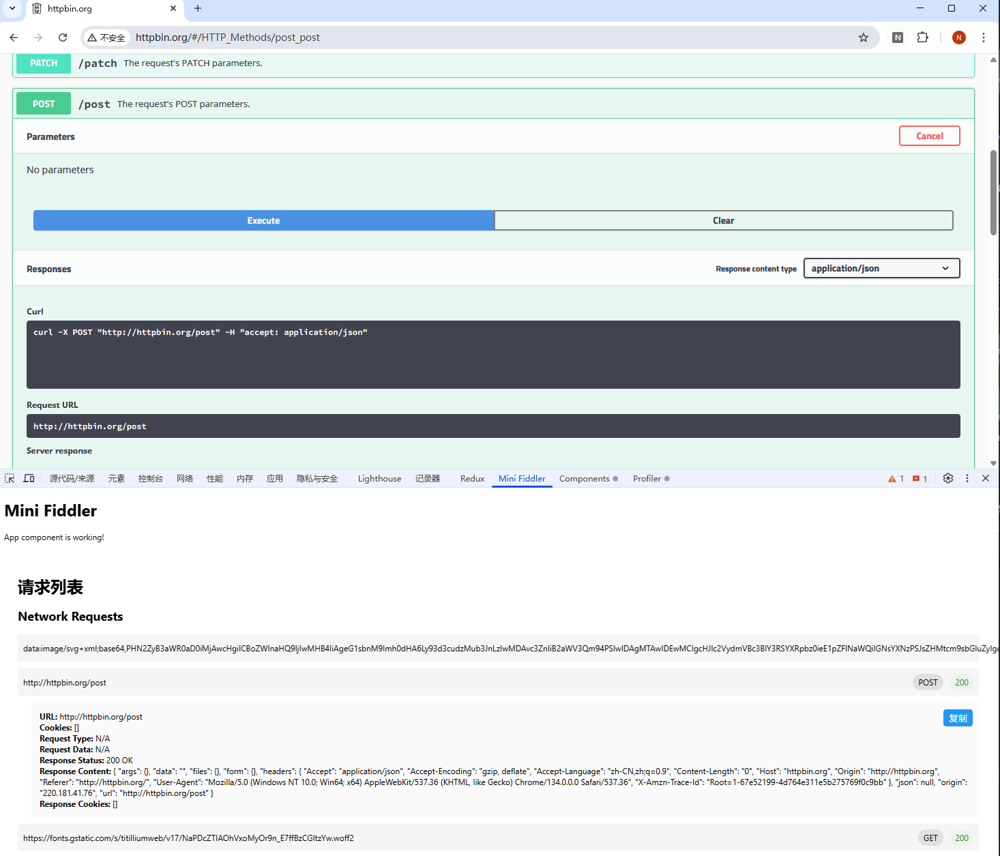

# 请求/响应复制工具

浏览器的开发者工具不能够同时复制请求体和响应体，本工具可以实现一键复制。

本项目是一个Chrome插件, 使用webpack打包, 使用mobx管理状态, 使用react开发UI, 使用typescript开发.

主要功能是在开发者工具中新增一个标签页Mini Fiddler, 可以查看当前页面的所有请求, 并进行过滤, 排序, 导出等操作.

执行 npm run build 打包后，在chrome中打开开发者模式，点击"加载已解压的扩展程序"，选择dist目录即可。每次打包后只需重新加载插件即可更新。

TODO:
- 过滤URL/请求体内容/响应体内容
- 导出请求体内容/响应体内容为文件
- 美化界面

power by Cursor